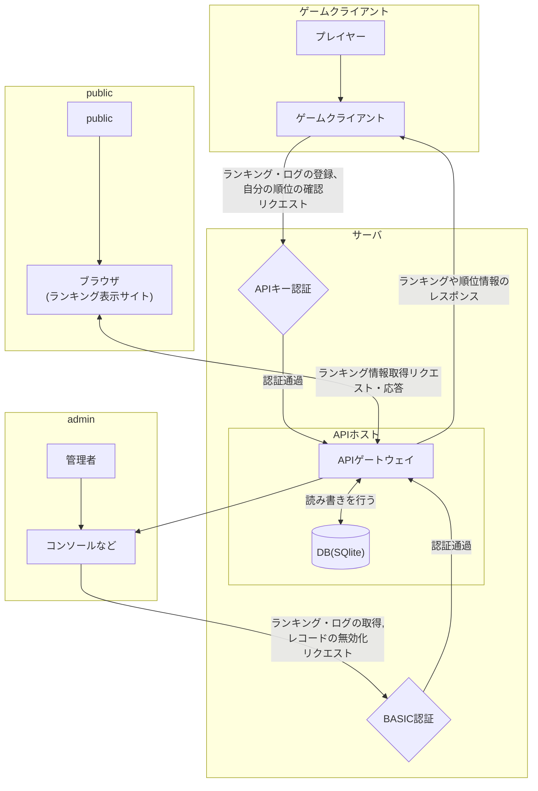
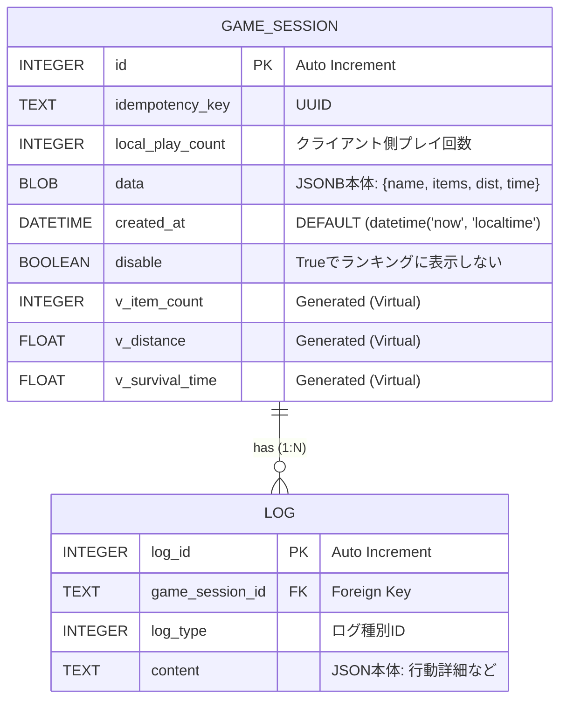
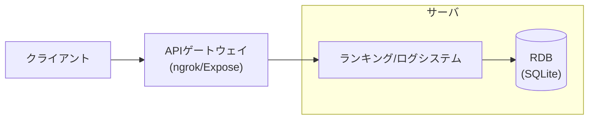
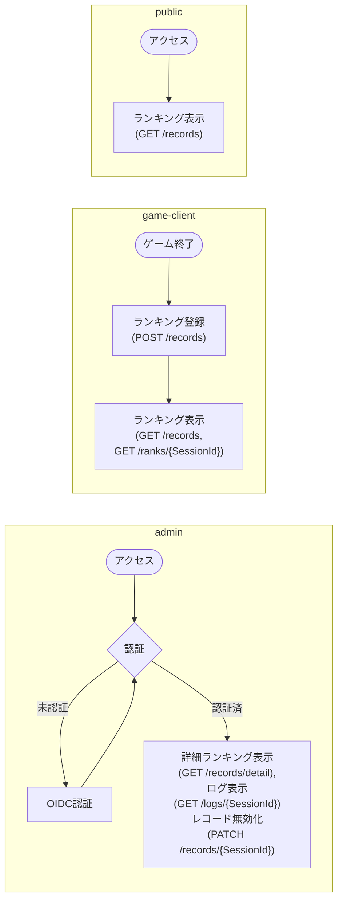

# 回答用紙 （学生用）

(本Markdownファイルを記入し、課題を完成、提出すること)

##  API実習　2025　課題レポート（第4回）
**API 実習課題**:　**API提供者として、API設計・実装するためのAPI要件定義の策定**

本課題（第4回レポート）は、**API提供者の立場で「API設計・実装」に必要な要件定義を策定する**ことを目的とする
これは、\*\*第5回（最終課題）\*\*で実装する API の基礎文書という位置づけである。
これまでの「API利用者視点」を踏まえ、**自ら設計・実装可能なレベルの要件定義**を作成する。

###  出題範囲：　API実習2025　第10回～第12回まで

 **対象授業回**：API実習 2025 **第10回〜第12回**の内容

###  提出期限：　2026/1/27(火) 17:00
-------

## タイトル：学生ゲーム開発者向け「簡易オンラインランキング・ログ」API作成アプリ（特定用途向け簡易APIホスティング・ソフトウェア）

レポート提出者：

|クラス|学籍番号|　氏名　|
|-|-|-|
|A| 20124024 | 関野 陽太 |


## 1. 背景・業務領域の具体化
- 対象ドメイン：
  - 大学のゲーム制作実習、展示会など、一時的なゲームの公開
- 現状業務（要約 5〜7行）：
  - 制作したゲームを発表会・展示会等で遊んでもらう際に、
  - ローカルで動作するゲームを複数端末にインストールして複数人に遊んでもらったり、
  デプロイしたものを各自の端末で遊んでもらったりする
  - ランキングシステムは作るとしてもローカル限定、各端末ごとに分離
  - 発表時に限らず、テストプレイでのスコアやタイム、死因などの情報収集もローカルで実施（実際にプレイする様子を見て確認するなど）
- 課題の所在（箇条書き）：
  - 既存のオンラインランキングシステムは、設定などが複雑であったり、プレイヤーごとに別のIDを用意する必要があったりで試遊向きでない（実装が簡単じゃない）
  - ランキング上位のプレイの特徴を確認したり、あまりに高すぎるスコアが出たときに要因を調べたりしたい
- 制約条件（法規／組織／リソース／期間）：
  - 個人のゲーム制作者が用意する機器でソフトウェアを動作させるため、メモリやCPUなどの使用量を低く抑える必要がある。
  （ローカルで実施時はゲームエンジンを既に動作させていて余裕が無く、クラウドで実施時は無料枠で納められるような範囲が望ましい）

---

## 2. 課題・目的・APIが必要な理由
- 解決すべき業務課題：ゲーム制作者がテストプレイ等のために、ランキング・ログ機能を仮実装するハードルを下げる
- APIの目的・役割：
  - 最低限の機能（単純なスコア・タイムによるランキング機能、ランキングのレコードとログを結び付ける機能）は設定等を行わなくても使用可能にする
  - ランキング・ログに記録する内容をスコア・タイムに限定せず、設定次第でカスタマイズできるようにする（汎用性を高める）
  - ランキングの取得、ランキング・ログの登録はある程度すばやくする必要がある（ログの取得はその限りでない）
- 成功指標（KPI）：
  - メモリ使用量：常時100MB以下
  - CPU負荷：平均1%以下、瞬間的には5%以下
  - 処理遅延（通信除く）：50ms以下

---

## 3. 対象ユーザ・ステークホルダ
- 主要ペルソナ：ゲーム制作者（主に個人開発者）
- ステークホルダ（事業者／運用者／データ提供者 等）：ゲーム制作者、プレイヤー
- 権限レベルとアクセス範囲：
  - `admin`：全操作（ログの取得、ランキングリセットなど含む）
  - `game-client`：ランキングの取得、ランキング・ログの登録
  - `public`：ランキングの取得のみ

---

## 4. 業務フロー・ユースケース図
### 4.1 ユースケース一覧
| ID | タイトル | 主要アクター | 概要 | 成功条件 |
|----|----------|--------------|------|----------|
| UC-01 |ゲームプレイ情報の送信と結果確認|`game-client`|プレイ中の行動ログを随時送信し、終了時にスコアを登録。その直後に最新のランキングを取得する。|1. ログとランキングレコードが紐付く。<br>2. 登録したスコアが即座にランキングに反映される。|
| UC-02 |外部サイネージでのランキング表示|`public` (Web等含む)|試遊会場のモニターやWebサイトへランキングを表示する。|1. 最新データが取得できる。<br>2. 高頻度の参照があっても、ゲーム側の登録処理を阻害しない。|
| UC-03 |特定プレイのログ詳細解析|`admin`|特定のランキングレコードに紐付いたログ一覧を取得・閲覧する。|1. スコアの妥当性（不正・バグがないか等）をログから検証できる。<br>2. 管理者専用の手段で安全にデータが提供される。|
| UC-04 |不正なランキングレコードの無効化|`admin`|ログを検証した結果不正な記録だと判明したレコードをランキングから除外できる。|1. レコードの除外が即座にランキングに反映される。|

### 4.2 業務フロー（Mermaid例）
**※下図の`APIホスト`を誰でも簡単に作成できることを目指す**


***

## 5. 関連技術・先行事例

* 採用候補技術：REST, ファイルベースDB, 高速・軽量フレームワーク, アクセス制限
* 参考標準・事例（URL可）：
  * SQLite
  * 高速・軽量なGoフレームワーク、Fiber(https://docs.gofiber.io/)
* 学習内容との対応（第10〜12回）：第11回アクセス制限

***

## 6. 提案技術の比較（選定理由）

| 観点                      | 候補A | 候補B | 比較結論 |
| ----------------------- | --- | --- | ---- |
| APIスタイル（REST/GraphQL 等） |REST|GraphQL|REST|
| データストア（RDB/NoSQL）       |RDB|NoSQL|RDB|
| 認証・認可（OAuth2/OIDC 等）    |APIキー+BASIC|APIキー+OIDC|APIキー+BASIC|
| デプロイ（クラウド/オンプレ）         |-|-|実際の使用者により変わる|

* 選定理由（トレードオフと採用根拠を3点以上）：
  * アクセスの目的がはっきりとしており、GraphQLの柔軟性が必要ないため。
  * 読み書きの速さではNoSQLが有利だが、ランキングシステムのように「上位から〇個取得」などは自前のインデックス管理などが必要になってしまうため。
  ただし、ランキング・ログの記載内容をカスタマイズできるようにしたいため、RDBのNoSQL的な運用（SQLiteのJSON関数を活用）を行う。
  * 認証等の設定もゲーム開発者にとって面倒な要素の一つであり、基本的な用途も限定的な公開であるため、ゲームクライアントの認証はAPIキーによる認証(悪意のないBOTやクローラによるアクセス数の増加を防ぐためだけなので、公開しても良い)のみ。
  管理者の認証にOIDCを使うと、例えばGoogleログインの場合`Client ID`や`Client Secret`などの設定が必要になるため、今回はシンプルなBASIC認証とした。
  非ローカルでの盗聴防止のためのhttps化を助ける機能、例えば自己署名証明書などは今回実装しない。(このアプリを非ローカルで使用したい開発者がngrokなどでhttps化する)

***

## ※以下は実際にこのアプリを使用してAPIを作成する際の内容のため、あくまで一例として示す。

### EX 例の概要

#### EX.1 背景
* 開発中のゲームを試遊会形式で限定公開したり、何人かのテストプレイヤーに配布し、プレイログを分析したい個人開発者
* アクションゲームで、アイテムを取得して自身を強化しつつ、やられてしまうまでにできるだけ進むことが目的のゲーム
* アイテム取得数や移動距離、生存時間で別々のランキングを作り、試遊会での競技性を高めるとともに分析に役立てたい

## 7. 機能要件

### 7.1 データ（モデル）要件

*   主要リソースと属性、整合性ルールと制約：
    *   ゲームセッション：ゲームプレイ一回分と結びつく情報
        *   レコードID：INTEGER(PK)
        *   クライアントUUID：TEXT(非NULL)：クライアント区別用UUID、ログ登録時に参照する
        *   プレイ回数：INTEGER(非NULL)：クライアント側のプレイ回数、ログ登録時に参照する
        *   データ：BLOB：SQliteのJSONBを用いたデータ領域
            *   ランキング表示名：TEXT
            *   アイテム取得数：INTEGER
            *   移動距離：FLOAT
            *   生存時間：FLOAT
        *   登録日時：DATETIME(非NULL)
        *   無効化：BOOLEAN：Trueの場合ランキングに表示しない
        *   \+インデックスのための仮想列
        *   ユニーク制約(UUID, プレイ回数)
    *   ログ：プレイ中の行動履歴
        *   ログID：INTEGER(PK)
        *   セッションID：TEXT(FK)：ログが結びつけられるセッションのID
        *   ログ種：INTEGER
        *   コンテンツ：TEXT：ログの中身をJSONで記載
*   ER図：


### 7.2 API機能リスト

| 機能ID | 概要 | 主要ユースケース | 優先度(P1/P2) |
| ---- | -- | -------- | ---------- |
| F-01 | ランキングを取得する | UC-01, UC-02 | P2 |
| F-02 | 管理者向け詳細情報付きランキングを取得する | UC-03 | P1 |
| F-03 | プレイレコードを登録する | UC-01 | P1 |
| F-04 | セッションに結び付く順位を確認する | UC-01 | P2 |
| F-05 | ログを登録する | UC-01 | P1 |
| F-06 | ランキングのレコードに結び付くログを取得する | UC-03 | P1 |
| F-07 | 不正なレコードをランキングから除外する | UC-04 | P2 |
| F-08 | サーバメトリクスを確認する | | P2 |

### 7.3 エンドポイント仕様

| # | メソッド | パス        | リクエスト（要約）        | レスポンス（要約）          | ステータス               | 認可     | レート制限   |
| - | ---- | --------- | ---------------- | ------------------ | ------------------- | ------ | ------- |
| 1 | GET  | /records | query: sort_by,sort_order,offset,limit | 200: list\<Records\> | 200/400/404/429/500         | `public` | 200/min |
| 2 | POST | /records | body: GameRecord | 200/201: Message | 200/201/400/401/403/429/500 | `game-client` | 200/min  |
| 3 | GET | /records/detail | query: sort_by,sort_order,offset,limit | 200: list\<RecordsWithDetail\> | 200/400/401/403/429/500 | `admin` | 20/min |
| 4 | PATCH | /records/{SessionId} | body: disable | 200:message | 200/400/401/403/404/429/500 | `admin` | 100/min |
| 5 | GET | /ranks/{SessionId} ||200:list\<Ranks\> | 200/400/401/403/404/429/500 | `admin`, `game-client` | 100/min |
| 6 | GET | /logs/{SessionId} | query: log_type,offset,limit | 200: list\<logs\> | 200/400/401/403/404/429/500 | `admin` | 50/min |
| 7 | POST | /logs | body: list\<Logs\> | 201: Message | 201/400/401/403/429/500 | `game-client` | 200/min |
| 8 | GET | /metrics |  | 200: Metrics | 200/400/401/403/429/500 | `admin` | 20/min |


*   エラー仕様（例）：
    *   400: ValidationError（フィールド：message, field, code）
    *   401: Unauthorized（トークン無効／期限切れ）
    *   403: Forbidden（権限不足）
    *   404: NotFound（資源なし）
    *   409: Conflict（重複／整合性違反）
    *   429: TooManyRequests（レート制限）
    *   500: InternalServerError

### 7.4 認証・認可・バージョニング等

*   認証方式：APIキー、BASIC認証
*   認可：ロールベース（admin/game-client/public）
*   バージョニング：`/v1` パスバージョン
*   レート制限：IP+トークン単位 50 req/min
*   エラーハンドリング：一貫したエラーレスポンス（`code`, `message`, `traceId`）

### 7.5 運用要件

*   監視：`/metrics`でのメトリクスの監視を行う。
*   ログ：構造化JSON、監査ログ保持期間1年以上
*   バックアップ：DB毎日スナップショット、RPO目標1d、RTO目標3h
*   秘密情報管理：APIキー、BASIC認証ユーザーIDは平文で、BASIC認証パスワードはハッシュ化してサーバ上の設定ファイル上で管理。

### 7.6 外部サービス一覧

| サービス | 用途 | 接続方式 | 想定障害時のフォールバック |
| ---- | -- | ---- | ------------- |
| ngrok | 通信のhttps化(トンネリングツール) | 認証トークンにより公開URL取得 | 無料プランでは時間制限があるExposeという代替ツールを一時的に使用するか、試遊会場などで本来のサーバが手元にないがクライアント端末がその場にあるという状況なら、あらかじめ用意しておいたランキング・ログアプリセットアップ済みの代わりのサーバに物理接続してローカル通信を行う。 |

### 7.7 システム構成図



### 7.8 画面要件（View/UI/UX）

*   主要画面：ランキング登録/ランキング表示/ログ表示
*   入力項目・検証ルール
    *   ランキング登録：ランキング表示名の入力：文字数制限、改行等制御文字の禁止のみ。GoにはHTML特殊文字のUNICODEエスケープ機能が備わっているため、これらは許可して問題ない。
*   API前提の画面遷移（簡易ワイヤー可）


***

## 8. 非機能要件

*   動作環境：
    *   言語：Go
    *   DB：Sqlite
    *   サーバ：オンプレ
*   性能：目標値　
    *   p95\<200ms, p99\<500ms
    *   同時70接続
    *   30rps
*   セキュリティ：
    *   ngrokによる通信暗号化（HTTPS/TLS）
    *   入力のバリデーションによるXSS,インジェクション攻撃対策
    *   ロールベースのアクセス管理による秘密情報取扱
*   可用性：
    *   稼働率99.5%以上(アプリが落ちることはなく、Wi-Fi障害などが無ければ問題なく稼働するという想定)
    *   障害時の復旧手順：外部ツールの障害時の対応は外部ツール一覧に記載した通り。シンプルな構成及び一時的な運用を前提としているため、初期障害のみ想定
*   拡張性：本システムはランキングの仮実装および、試遊会などでのテストプレイデータ収集を目的としているため、ゲームのテストが完了すれば停止するシステムとして拡張は想定しない。
*   保守性：設定を整えてアプリを立ち上げるだけの構成のため、ゲーム開発者は保守を考慮しない。

***

## 9. まとめ

*   要件の妥当性（根拠）：
    *   最低限の設定のみですぐに使い始められることを目指し、ゲーム開発者側で設定が必要になる事柄をできる限り避けた設計及び要件設定にしている。
    *   動的な仮想列生成により、設定ファイルに応じた動的なインデックス設定を可能にしている。また、JSONデータへのアクセス回数が非常に多くなるため、パースが不要になるJSONBを用いる。
    インサートが少しだけ遅くなるとのことだが、実用上は問題ない範囲かつパースが不要になるメリットの方が大きいと判断。
    *   ログ登録はリストでの登録とすることで、複数のログをまとめて送信させ、リクエスト回数を減らす設計にすることをゲーム開発者に促す。
    *   同時接続数などは、試遊会など限定的に公開される環境で使う上ではかなり余裕を持った目標設定である。
*   実装への影響（第5回のスコープ）：
    *   **ランキング登録機能・ログ登録機能・ランキングと連携したログ確認機能**がこのアプリのメイン機能であり、他の機能は一緒にできると便利なついでの機能であるため、これらメイン機能を優先的に実装するべきである。
    *   開発者の負担を減らすという意味では、UUIDの生成・ヘッダーへの付与や、ログがある程度貯まった段階での自動送信などを簡略化するC#(Unity向け)ライブラリや、管理者向け機能にアクセスするコンソールなどもあった方が良いが、第5回のスコープには含めない。
*   リスクと対応（最低3件）：
    *   急増トラフィック → レート制限、キャッシュ
    *   リクエストの多重送信 → UUIDによる冪等性確保
    *   ゲームのクラッシュによるゾンビセッション発生 → 新しいUUIDとプレイ回数の組でログが投稿された際にセッションレコードを新しく生成するが、ハンドシェイク等は行わない暗黙的セッション生成による、セッション継続にコストを必要としない設計

***

## 10. 付録（任意加点）

### 10.1 OpenAPIドラフト（抜粋）

```yaml
openapi: 3.0.3
info:
  title: Game Backend API (Lightweight)
  description: |
    ゲーム開発者向け軽量バックエンドAPIの仕様定義。
    SQLite + JSONカラムを活用し、スキーマレスなデータ保存とランキング集計を提供する。
  version: 1.0.0
servers:
  - url: http://localhost:8080/api/v1
    description: ローカル開発環境
  - url: https://hogehoge-fizz-buzz.ngrok-free.dev/api/v1
    description: ngrokの無料プランによるhttps化したリンク例

tags:
  - name: Public
    description: 誰でもアクセス可能なエンドポイント
  - name: GameClient
    description: ゲームクライアントからのデータ送信用（APIキーが必要）
  - name: Admin
    description: 管理者用・詳細データ閲覧用（管理者パスワードが必要）

paths:
  # ----------------------------------------------------------------
  # 1. GET /records (ランキング取得)
  # ----------------------------------------------------------------
  /records:
    get:
      summary: ランキングの取得
      description: |
        集計済みのランキングデータを取得する。disable=trueのレコードは除外される。
        レート制限: 200/min (Global)
      tags:
        - Public
      security: [] # Public access
      parameters:
        - name: sort_by
          in: query
          description: ソート基準となるキー（例：score, time）
          schema:
            type: string
            default: score
        - name: sort_order
          in: query
          schema:
            type: string
            enum: [asc, desc]
            default: desc
        - name: offset
          in: query
          schema:
            type: integer
            default: 0
        - name: limit
          in: query
          schema:
            type: integer
            default: 10
      responses:
        '200':
          description: 成功
          content:
            application/json:
              schema:
                type: array
                items:
                  $ref: '#/components/schemas/PublicRecord'
        '400':
          $ref: '#/components/responses/BadRequest'
        '429':
          $ref: '#/components/responses/TooManyRequests'
        '500':
          $ref: '#/components/responses/InternalServerError'

    # ----------------------------------------------------------------
    # 2. POST /records (プレイレコード/スコア登録)
    # ----------------------------------------------------------------
    post:
      summary: プレイ結果の登録
      description: |
        ゲームプレイの結果を登録する。既存のセッションIDとプレイ回数の組の場合は更新(200)、新規の場合は作成(201)となる。
        レート制限: 200/min (Global)
      tags:
        - GameClient
      security:
        - GameApiKey: []
      requestBody:
        required: true
        content:
          application/json:
            schema:
              $ref: '#/components/schemas/GameRecordInput'
      responses:
        '200':
          description: レコード更新成功
          content:
            application/json:
              schema:
                $ref: '#/components/schemas/SuccessMessage'
        '201':
          description: 新規レコード作成成功
          content:
            application/json:
              schema:
                $ref: '#/components/schemas/SuccessMessage'
        '401':
          $ref: '#/components/responses/Unauthorized'
        '429':
          $ref: '#/components/responses/TooManyRequests'

  # ----------------------------------------------------------------
  # 3. GET /records/detail (管理者向け全件取得)
  # ----------------------------------------------------------------
  /records/detail:
    get:
      summary: レコード詳細リストの取得（管理者用）
      description: |
        不正判定フラグ(disable)やIPアドレスなどを含む詳細なリストを取得する。
        レート制限: 20/min
      tags:
        - Admin
      security:
        - AdminAuth: []
      parameters:
        - name: offset
          in: query
          schema:
            type: integer
            default: 0
        - name: limit
          in: query
          schema:
            type: integer
            default: 50
      responses:
        '200':
          description: 詳細リスト
          content:
            application/json:
              schema:
                type: array
                items:
                  $ref: '#/components/schemas/AdminRecordDetail'
        '401':
          $ref: '#/components/responses/Unauthorized'

  # ----------------------------------------------------------------
  # 4. PATCH /records/{SessionId} (レコード無効化)
  # ----------------------------------------------------------------
  /records/{SessionId}:
    patch:
      summary: レコードの無効化/有効化
      description: |
        特定のセッションレコードをランキングから除外(disable)する。
        レート制限: 100/min
      tags:
        - Admin
      security:
        - AdminAuth: []
      parameters:
        - name: SessionId
          in: path
          required: true
          description: 対象のセッションID (または UUID)
          schema:
            type: string
      requestBody:
        required: true
        content:
          application/json:
            schema:
              type: object
              properties:
                disable:
                  type: boolean
                  description: trueでランキング除外
      responses:
        '200':
          description: 更新成功
          content:
            application/json:
              schema:
                $ref: '#/components/schemas/SuccessMessage'
        '404':
          $ref: '#/components/responses/NotFound'

  # ----------------------------------------------------------------
  # 5. GET /ranks/{SessionId} (順位確認)
  # ----------------------------------------------------------------
  /ranks/{SessionId}:
    get:
      summary: 特定セッションの順位確認
      description: |
        指定されたセッションIDが現在何位に位置するかを取得する。
        レート制限: 100/min
      tags:
        - GameClient
        - Admin
      security:
        - GameApiKey: []
        - AdminAuth: []
      parameters:
        - name: SessionId
          in: path
          required: true
          schema:
            type: string
      responses:
        '200':
          description: 順位情報
          content:
            application/json:
              schema:
                $ref: '#/components/schemas/RankInfo'
        '404':
          $ref: '#/components/responses/NotFound'

  # ----------------------------------------------------------------
  # 6. GET /logs/{SessionId} (ログ取得)
  # ----------------------------------------------------------------
  /logs/{SessionId}:
    get:
      summary: プレイログの取得
      description: |
        特定のプレイセッションに紐付くログ一覧を取得する。
        レート制限: 50/min
      tags:
        - Admin
      security:
        - AdminAuth: []
      parameters:
        - name: SessionId
          in: path
          required: true
          schema:
            type: string
        - name: log_type
          in: query
          schema:
            type: integer
        - name: offset
          in: query
          schema:
            type: integer
        - name: limit
          in: query
          schema:
            type: integer
      responses:
        '200':
          description: ログ一覧
          content:
            application/json:
              schema:
                type: array
                items:
                  $ref: '#/components/schemas/LogEntry'

  # ----------------------------------------------------------------
  # 7. POST /logs (ログ一括登録)
  # ----------------------------------------------------------------
  /logs:
    post:
      summary: プレイログのバッチ登録
      description: |
        クライアントでバッファリングされたログを配列として一括送信する。
        初回送信時にセッションが存在しない場合、自動的に新規セッションが確保される。
        レート制限: 200/min
      tags:
        - GameClient
      security:
        - GameApiKey: []
      requestBody:
        required: true
        content:
          application/json:
            schema:
              type: array
              items:
                $ref: '#/components/schemas/LogEntryInput'
      responses:
        '201':
          description: ログ保存成功
          content:
            application/json:
              schema:
                $ref: '#/components/schemas/SuccessMessage'

  # ----------------------------------------------------------------
  # 8. GET /metrics (サーバーメトリクス)
  # ----------------------------------------------------------------
  /metrics:
    get:
      summary: サーバー稼働情報の取得
      description: |
        総セッション数、メモリ使用量、エラー率などの統計情報を取得する。
        レート制限: 20/min
      tags:
        - Admin
      security:
        - AdminAuth: []
      responses:
        '200':
          description: メトリクス情報
          content:
            application/json:
              schema:
                $ref: '#/components/schemas/ServerMetrics'

# ----------------------------------------------------------------
# コンポーネント定義 (データ構造・セキュリティ等)
# ----------------------------------------------------------------
components:
  securitySchemes:
    # ゲームクライアント用APIキー
    GameApiKey:
      type: apiKey
      in: header
      name: X-Game-Key
    # 管理者用認証 (Basic認証 または 設定ファイル定義のBearer)
    # ここでは実装の簡易さを考慮しBasic認証の例を記載
    AdminAuth:
      type: http
      scheme: basic

  schemas:
    # 汎用メッセージ
    SuccessMessage:
      type: object
      properties:
        message:
          type: string
          example: "Success"
    
    # 公開用レコード (ランキング表示用)
    PublicRecord:
      type: object
      properties:
        rank:
          type: integer
        display_name:
          type: string
        score:
          type: integer
        # dataの中身は設定ファイルにより可変
        data:
          type: object
          additionalProperties: true
          description: "設定ファイルで定義された任意のJSONデータ"

    # 入力用レコード
    GameRecordInput:
      type: object
      required:
        - uuid
        - play_count
        - data
      properties:
        uuid:
          type: string
          format: uuid
        play_count:
          type: integer
        data:
          type: object
          additionalProperties: true

    # 管理者用詳細レコード
    AdminRecordDetail:
      allOf:
        - $ref: '#/components/schemas/PublicRecord'
        - type: object
          properties:
            uuid:
              type: string
            session_id:
              type: string
            ip_address:
              type: string
            created_at:
              type: string
              format: date-time
            disable:
              type: boolean

    # 順位情報
    RankInfo:
      type: object
      properties:
        rank:
          type: integer
        total_records:
          type: integer
        percentile:
          type: number
          format: float

    # ログ入力
    LogEntryInput:
      type: object
      required:
        - uuid
        - play_count
        - log_type
        - content
      properties:
        uuid:
          type: string
          format: uuid
        play_count:
          type: integer
        log_type:
          type: integer
        content:
          type: object
          additionalProperties: true
        timestamp:
          type: integer
          description: "Unix Timestamp (Client Time)"

    # ログ出力
    LogEntry:
      allOf:
        - $ref: '#/components/schemas/LogEntryInput'
        - type: object
          properties:
            id:
              type: integer
            server_timestamp:
              type: string
              format: date-time

    # メトリクス
    ServerMetrics:
      type: object
      properties:
        uptime_seconds:
          type: integer
        total_sessions:
          type: integer
        requests_per_minute:
          type: number
        db_size_bytes:
          type: integer

  responses:
    BadRequest:
      description: パラメータ不正
    Unauthorized:
      description: 認証失敗 (キーまたはパスワード不一致)
    NotFound:
      description: リソースが存在しない
    TooManyRequests:
      description: レート制限超過
    InternalServerError:
      description: サーバー内部エラー
```


## 参考文献

*   【Go言語】フレームワーク8種のベンチマークを測定してみた(https://qiita.com/twrcd1227/items/d871480ec9f8a581099e)
*   Go Fiber公式ドキュメント (https://docs.gofiber.io/)
*   SQLite で利用できる JSON 関数の使い方総まとめ(https://qiita.com/nimzo6689/items/785a3de61fa68ef975c5)
*   SQlite JSONB（https://sqlite.org/jsonb.html）
*   SQLite Generated Columns (https://sqlite.org/gencol.html)
*   Idempotency-Key Headerの現状・仕様・実装の理解を助けるリソースまとめ(https://ohbarye.hatenablog.jp/entry/2021/09/06/idempotency-key-header-resources)

***

## 記述チェックリスト

*   [x] 背景・業務領域
*   [x] 課題／目的／必要性
*   [x] ユーザ／ステークホルダ
*   [x] 業務フロー／ユースケース
*   [x] 関連技術／先行事例
*   [x] 技術比較／選定理由
*   [x] 機能要件（データ／機能／運用／外部サービス／構成図／画面）
*   [x] 非機能要件（環境／性能／セキュリティ／可用性／拡張性／保守性）
*   [x] まとめ（リスク・優先度）
*   [x] 参考文献

### 使い方のヒント
- **定量化**：非機能要件は「測れる数値」で書く（p95レイテンシ、5xx率、SLA%等）。
- **一貫性**：ユースケース→機能要件→エンドポイント→画面要件が整合しているか確認。
- **セキュリティ**：認証・認可、エラー、ログ、秘密情報の扱いを明記。
- **運用目線**：監視・バックアップ・障害時対応を具体化（RPO/RTO）。
- **将来拡張**：バージョニング、レート制限、スキーマ進化に触れる。
